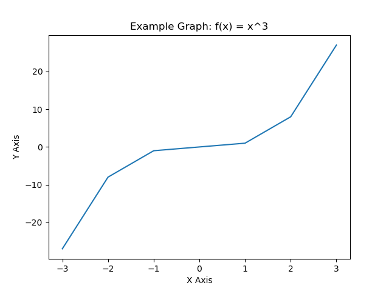

# C++ & Matplotlib

This library uses Python 'shaders' to produce graphical plots from C++ executables, for example when doing financial modelling.

This approach can seem a little bit jank. The C++ executable uses a Python session and passes data through to it to be 'rendered'. That said, if you don't want a codebase with Python scripts, you can write your shader code directly into the .cpp file as a string.



This image is generated by the library, it's just a simple example but you could make more complex plots such as volatility curves ;)

## Requirements

- nlohmann::json
- Python3
- Matplotlib

## Installation

Run the following commands in a terminal to install the library:

```
git clone https://github.com/josh-orio/cplotlib
cd cplotlib
make
```